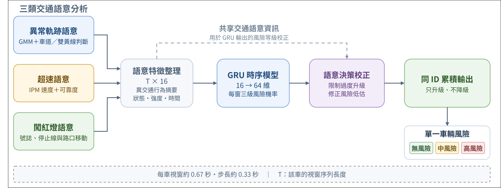
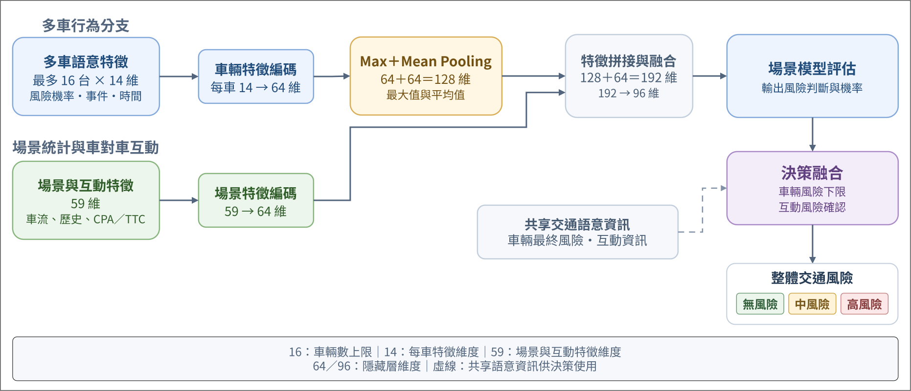

# Multi-Semantic Traffic Risk Assessment

> [!NOTE]
> 目前公開內容以研究說明、架構圖、展示影片與論文為主。程式碼與完整執行流程仍在整理中，將盡快更新上線。

一個以固定式道路影像為輸入的多語意交通風險評估框架，整合車輛追蹤、道路幾何、超速、闖紅燈、異常軌跡與車對車互動，輸出無／中／高三級交通風險。

**[觀看影片](#展示案例)** · **[研究方法](docs/methodology.md)** · **[模型架構](docs/models.md)** · **[模擬資料](docs/simulation.md)** · **[論文](docs/publications/paper.pdf)**

  

## 為什麼要做這個系統？

單一違規偵測難以表示完整交通風險。車輛可能先出現逆向或蛇行，接著同時發生超速、闖紅燈，或與其他車輛形成碰撞趨勢。因此，本研究不只辨識單一事件，而是結合車輛行為、道路語意與多車互動，判斷整體場景是否需要提高警示。

更完整的問題定義與設計目標請見 [研究動機](docs/motivation.md)。

## 展示案例

點擊縮圖可在 YouTube 觀看。四支原始影片與結果影片也保留在 GitHub [Demo Release](https://github.com/chengting0822/multi-semantic-traffic-risk/releases/tag/demo-v1)，方便下載。

| Case 1：停等紅燈後逆向行駛並闖紅燈 | Case 2：高車流情境下蛇行穿梭 |
|---|---|
|  |  |
| [▶ YouTube](https://youtu.be/1Ru3lnquvQg) · [原始影片.mp4](https://github.com/chengting0822/multi-semantic-traffic-risk/releases/download/demo-v1/14.mp4) · [結果影片](https://github.com/chengting0822/multi-semantic-traffic-risk/releases/download/demo-v1/case01-wrong-way-red-light-violation.mp4) | [▶ YouTube](https://youtu.be/rfI7OGqpWos) · [原始影片.mp4](https://github.com/chengting0822/multi-semantic-traffic-risk/releases/download/demo-v1/76.mp4) · [結果影片](https://github.com/chengting0822/multi-semantic-traffic-risk/releases/download/demo-v1/case02-weaving-dense-traffic.mp4) |
| Case 3：逆向行駛且嚴重超速 | Case 4：逆向、超速與闖紅燈的複合違規 |
|  |  |
| [▶ YouTube](https://youtu.be/QFT_Z3-kAdk) · [原始影片.mp4](https://github.com/chengting0822/multi-semantic-traffic-risk/releases/download/demo-v1/96.mp4) · [結果影片](https://github.com/chengting0822/multi-semantic-traffic-risk/releases/download/demo-v1/case03-severe-speeding-wrong-way.mp4) | [▶ YouTube](https://youtu.be/pQrlSh7QFvE) · [原始影片.mp4](https://github.com/chengting0822/multi-semantic-traffic-risk/releases/download/demo-v1/115.mp4) · [結果影片](https://github.com/chengting0822/multi-semantic-traffic-risk/releases/download/demo-v1/case04-red-light-wrong-way-combined.mp4) |

案例情境與觀看重點請見 [展示案例說明](docs/demo.md)。

## 方法重點

1. **影像感知**：使用 YOLO 偵測車輛、ByteTrack 建立軌跡，再以固定號誌 ROI 上的輕量 CNN 辨識紅／綠燈。
2. **道路幾何**：標定有效 ROI、車道範圍與方向、虛擬停止線，並使用 IPM 將影像座標投影到世界座標。
3. **多語意行為**：將速度、號誌、停止線、車道方向與軌跡轉換為超速、闖紅燈與異常軌跡語意。
4. **單一車輛風險**：將 16 維語意時間序列輸入 GRU，再結合交通語意規則與累積式輸出。
5. **場景風險**：聚合最多 16 台車輛、場景統計及 CPA/TTC 互動特徵，輸出整體交通風險。

完整流程、車道標定圖與互動特徵請見 [研究方法](docs/methodology.md)；網路維度與融合方式請見 [模型架構](docs/models.md)。

<strong>展開：單一車輛與場景風險架構圖</strong>

### 單一車輛風險

### 場景風險

## 模擬資料：OpenStreetMap → SUMO → CARLA

研究在 Ubuntu 22.04 環境下，以 OpenStreetMap 建立道路幾何，透過 SUMO 產生背景交通流，再匯入 CARLA 建立視覺場景。高風險車輛使用 CARLA 內建鍵盤駕駛功能由研究人員操控，用來建立自動交通流不易自然產生的逆向、蛇行、超速、闖紅燈與複合行為。

| 真實道路參考 | CARLA 模擬影像 |
|---|---|
|  |  |

模擬流程、人工操控原則與資料限制請見 [模擬資料說明](docs/simulation.md)。

## 論文結果

| 評估項目 | 結果 |
|---|---:|
| 單一車輛風險，video-level 5-fold，window Macro F1 | 0.8894 ± 0.0084 |
| 單一車輛風險，video-level 5-fold，track Macro F1 | 0.9227 ± 0.0417 |
| 場景風險，固定 test，severity Macro F1 | 0.9339 |
| 場景風險，固定 test，無／中／高風險 F1 | 0.9812 / 0.8674 / 0.9531 |

以上為論文研究流程的評估結果。單一車輛結果採跨影片 5-fold 與一致標籤評估；場景結果採固定測試集，兩者評估方式不同。詳細方法與實驗說明請參閱 [論文全文](docs/publications/paper.pdf)。

## 研究開發環境

| 項目 | 環境／工具 |
|---|---|
| 作業系統 | Ubuntu 22.04 LTS |
| 程式語言 | Python 3.10+ |
| 深度學習 | PyTorch |
| 影像處理 | OpenCV、Ultralytics YOLO |
| 多目標追蹤 | ByteTrack |
| 模擬環境 | OpenStreetMap、SUMO、CARLA |
| 運算 | NVIDIA GPU |

## 研究文件

| 文件 | 內容 |
|---|---|
| [研究動機](docs/motivation.md) | 問題背景、研究缺口與設計目標 |
| [模擬資料](docs/simulation.md) | OSM → SUMO → CARLA 與人工高風險操控 |
| [研究方法](docs/methodology.md) | 道路幾何、車道、停止線、CNN 與多語意分析 |
| [模型架構](docs/models.md) | 單一車輛 GRU、場景特徵聚合與融合維度 |
| [偵測與追蹤](docs/detection.md) | YOLO、ByteTrack、號誌 CNN 與研究參數 |
| [展示案例](docs/demo.md) | 四個情境、YouTube 與原始／結果影片 |

## 團隊與貢獻

- **蔡承廷**：專題規劃與核心系統開發，負責影像處理流程、道路幾何與交通語意建模、風險模型實驗、系統整合及成果展示。
- **林武杰老師**：專題指導、研究方向與實驗設計建議。
- **劉康申、謝宏喆**：協助資料處理、模擬資料建立及研究討論。

## 論文與獲獎

- [論文全文](docs/publications/paper.pdf)
- [CVGIP 正式簡報](docs/publications/cvgip-presentation.pdf)
- [CVGIP 2026 論文發表證明](assets/awards/cvgip-certificate.jpg)
- [國立虎尾科技大學資訊工程系專題競賽第三名](assets/awards/university-project-third-place.jpg)
