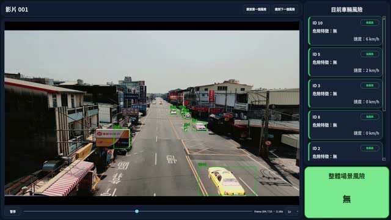
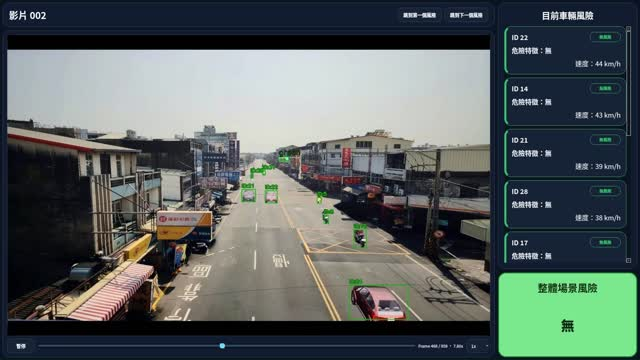
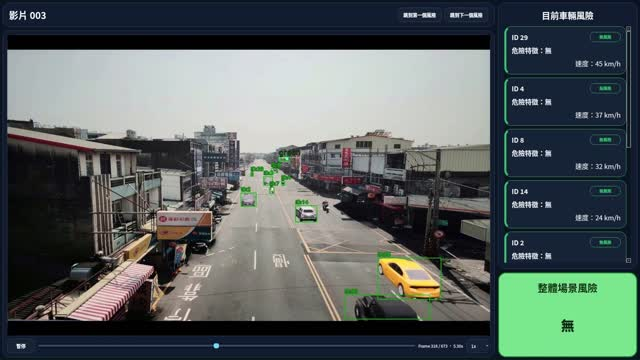
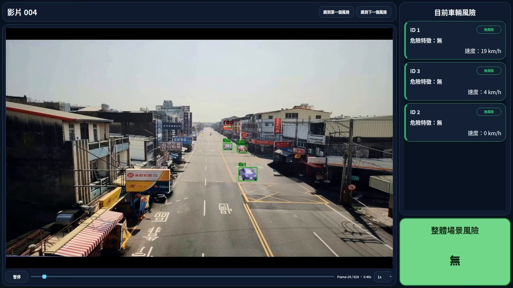
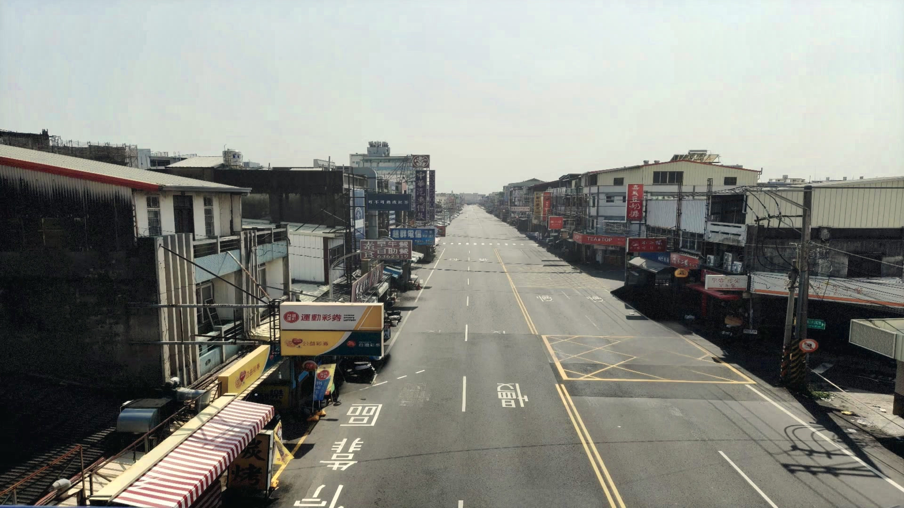
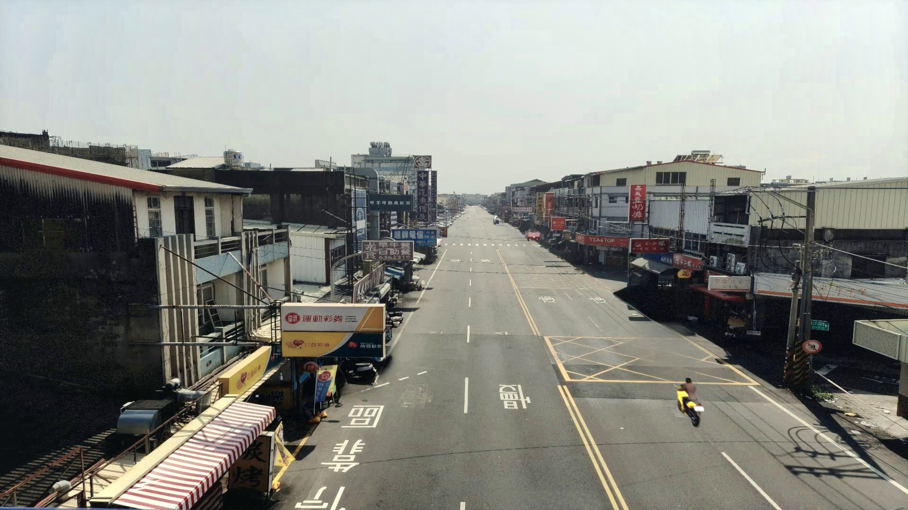

# Multi-Semantic Traffic Risk Assessment


一個以固定式道路影像為輸入的多語意交通風險評估框架，整合車輛追蹤、道路幾何、超速、闖紅燈、異常軌跡與車對車互動，輸出無／中／高三級交通風險。

**[執行 Demo](#快速開始)** · **[觀看影片](#展示案例)** · **[研究方法](docs/methodology.md)** · **[模擬資料](docs/simulation.md)** · **[論文](docs/publications/paper.pdf)**

<p align="center">
  
</p>

## 為什麼要做這個系統？

單一違規偵測難以表示完整交通風險。車輛可能先出現逆向或蛇行，接著同時發生超速、闖紅燈，或與其他車輛形成碰撞趨勢。因此，本研究不只辨識單一事件，而是結合車輛行為、道路語意與多車互動，判斷整體場景是否需要提高警示。

更完整的問題定義與設計目標請見 [研究動機](docs/motivation.md)。

## 快速開始

建議在 Ubuntu 22.04 與 Python 3.10 環境執行：

```bash
python -m venv .venv
source .venv/bin/activate
pip install -e '.[detection]'
./scripts/run_demo.sh --device cpu
```

內建 Demo 會真正執行凍結場景模型與正式 Hybrid 融合，並將輸出與論文正式結果逐列比對：

```text
verified_rows=183 mismatches=0
case01 video=14  peak=3 (高風險)
case02 video=76  peak=3 (高風險)
case03 video=96  peak=3 (高風險)
case04 video=115 peak=3 (高風險)
```

預設輸出為 `outputs/demo_scene_risk.csv`。範例使用從正式資料擷取的 183 個場景時間窗，不是隨機產生的假資料。

下載四支原始示範影片（影片放在 Release，不增加 Git repository 體積）：

```bash
python scripts/download_demo_videos.py
```

下載後會得到 `data/demo_videos/{14,76,96,115}.mp4`，並以 SHA-256 驗證檔案。

## 展示案例

點擊縮圖可直接在 YouTube 觀看；原始影片與結果影片也保留在 GitHub `demo-v1` Release，方便下載與備份。

| Case 1：停等紅燈後逆向行駛並闖紅燈 | Case 2：高車流情境下蛇行穿梭 |
|---|---|
| <a href="https://youtu.be/1Ru3lnquvQg"></a> | <a href="https://youtu.be/rfI7OGqpWos"></a> |
| [▶ YouTube](https://youtu.be/1Ru3lnquvQg) · [原始影片.mp4](../../releases/download/demo-v1/14.mp4) · [結果影片](../../releases/download/demo-v1/case01-wrong-way-red-light-violation.mp4) | [▶ YouTube](https://youtu.be/rfI7OGqpWos) · [原始影片.mp4](../../releases/download/demo-v1/76.mp4) · [結果影片](../../releases/download/demo-v1/case02-weaving-dense-traffic.mp4) |
| Case 3：逆向行駛且嚴重超速 | Case 4：逆向、超速與闖紅燈的複合違規 |
| <a href="https://youtu.be/QFT_Z3-kAdk"></a> | <a href="https://youtu.be/pQrlSh7QFvE"></a> |
| [▶ YouTube](https://youtu.be/QFT_Z3-kAdk) · [原始影片.mp4](../../releases/download/demo-v1/96.mp4) · [結果影片](../../releases/download/demo-v1/case03-severe-speeding-wrong-way.mp4) | [▶ YouTube](https://youtu.be/pQrlSh7QFvE) · [原始影片.mp4](../../releases/download/demo-v1/115.mp4) · [結果影片](../../releases/download/demo-v1/case04-red-light-wrong-way-combined.mp4) |

案例說明、影片雜湊與可執行資料請見 [Demo 文件](docs/demo.md)。

## 方法重點

1. **影像感知**：使用 YOLO 偵測車輛、ByteTrack 建立軌跡，再以固定號誌 ROI 上的輕量 CNN 辨識紅／綠燈。
2. **道路幾何**：標定有效 ROI、車道範圍與方向、虛擬停止線，並使用 IPM 將影像座標投影到世界座標。
3. **多語意行為**：將速度、號誌、停止線、車道方向與軌跡轉換為超速、闖紅燈與異常軌跡語意。
4. **單一車輛風險**：將 16 維語意時間序列輸入 Causal GRU，再結合可解釋政策與累積式輸出。
5. **場景風險**：聚合最多 16 台車輛、場景統計及 CPA/TTC 互動特徵，輸出整體交通風險。

完整流程、車道標定圖、虛擬停止線與互動特徵請見 [研究方法](docs/methodology.md)；網路維度與融合方式請見 [模型架構](docs/models.md)。

## 模擬資料：OpenStreetMap → SUMO → CARLA

研究在 Ubuntu 22.04 環境下，以 OpenStreetMap 建立道路幾何，透過 SUMO 產生背景交通流，再匯入 CARLA 建立視覺場景。高風險車輛使用 CARLA 內建鍵盤駕駛功能由研究人員操控，用來建立自動交通流不易自然產生的逆向、蛇行、超速、闖紅燈與複合行為。

| 真實道路參考 | CARLA 模擬影像 |
|---|---|
| [](../../releases/download/simulation-v1/real-road-reference.mp4) | [](../../releases/download/simulation-v1/carla-road-simulation.mp4) |

模擬流程、人工操控原則與資料限制請見 [模擬資料說明](docs/simulation.md)。

## 論文結果

| 評估項目 | 結果 |
|---|---:|
| 單一車輛風險，video-level 5-fold，window Macro F1 | 0.8894 ± 0.0084 |
| 單一車輛風險，video-level 5-fold，track Macro F1 | 0.9227 ± 0.0417 |
| 場景風險，固定 test，severity Macro F1 | 0.9339 |
| 場景風險，固定 test，無／中／高風險 F1 | 0.9812 / 0.8674 / 0.9531 |

整理版鎖定正式 checkpoint 與程式後，對原始正式輸出逐列驗證。單一車輛模型、單一車輛政策鏈、場景模型與 Hybrid 融合的離散輸出皆為 **0 筆差異**。詳見 [等價驗證](docs/parity.md)。

## 車輛偵測與追蹤

新手可用論文期間的預設參數執行：

```bash
./scripts/run_detection.sh input.mp4 /path/to/yolo26x.pt outputs/tracks.csv
```

YOLO 權重與 TensorRT engine 因體積及環境差異不納入 repository；號誌 CNN、ByteTrack 設定與道路 ROI 則已附上。

## 完整風險流程與時間標註

四支 Release 影片是對外展示與回歸驗證資料，**不是程式的影片白名單**。核心流程接受任意影片路徑與文字影片 ID。

追蹤 CSV 可先用串流方式建立時間欄與每車時間視窗；即使是大型 CSV，也不會整份載入記憶體：

```bash
traffic-risk prepare-tracks \
  outputs/my-video/tracks.csv \
  /path/to/my-video.mp4 \
  outputs/my-video/upstream \
  --video-id intersection-a
```

現在也可以從任意影片離線跑到最終風險；YOLO 權重需自行提供，道路幾何設定必須對應影片的攝影機：

```bash
traffic-risk run-video /path/to/intersection-a.mp4 outputs/intersection-a \
  --yolo-model /path/to/yolo26x.pt \
  --video-id intersection-a
```

若已有追蹤 CSV，可改用 `--tracks-csv outputs/tracks.csv` 跳過 YOLO。它只選汽車軌跡，但同一 `track_id` 的偶發類別跳動幀會保留。完整參數與分步執行方式見 [執行流程](docs/pipeline.md)。若想分別檢查 IPM 超速與闖紅燈分支，也可直接執行：

```bash
traffic-risk build-overspeed \
  outputs/my-video/upstream/timestamps/intersection-a.csv \
  outputs/my-video/upstream/reference_windows.csv \
  outputs/my-video/upstream/overspeed \
  --ipm configs/ipm.json
```

闖紅燈分支也使用同一份時間視窗：

```bash
traffic-risk build-redlight \
  outputs/my-video/upstream/timestamps/intersection-a.csv \
  outputs/my-video/upstream/reference_windows.csv \
  outputs/my-video/upstream/redlight \
  --stop-lines configs/stop_lines.json
```

整理版已將正式的 16 維單一車輛模型、完整語意政策鏈、最多 16 台車的場景聚合、59 維場景模型及 Hybrid 融合接成同一個命令：

```bash
traffic-risk run-risk \
  outputs/upstream/c4o_features.csv \
  outputs/upstream/trajectory_features.csv \
  outputs/tracks \
  outputs/case14 \
  --device auto
```

輸出包含可稽核的 v0／v8 中間特徵、C4O 輸入、單一車輛與場景風險，以及最終 `risk/traffic_risk.csv`。四支展示影片只是回歸範例，程式沒有影片白名單。研究期舊表和新版汽車同 ID 類別跳動政策可能有少量數值差異，詳見 [等價驗證](docs/parity.md)。

時間標註工具可直接讀取影片與追蹤框。Demo ID 會自動套用內建路徑：

```bash
traffic-risk annotate 14 --tracks outputs/14/tracks.csv
# 相容舊名稱的入口
python scripts/tcn_annotation_gui.py 14 --tracks outputs/14/tracks.csv
```

任意影片則指定路徑：

```bash
traffic-risk annotate intersection-a \
  --video /path/to/intersection-a.mp4 \
  --tracks outputs/intersection-a/tracks.csv \
  --output annotations/intersection-a.json
```

可標註整體場景或指定車輛的風險區間，輸出格式與原本 `tcn_annotation_gui.py` 相容；介面程式已獨立整理，不依賴原始大型專案的絕對路徑。

<details>
<summary><strong>展開：完整偵測參數與舊版 yolotest.py 指令</strong></summary>

完整指令、參數表與舊新介面對照放在 [偵測與追蹤文件](docs/detection.md)。

</details>

## 開發環境

| 項目 | 環境／工具 |
|---|---|
| 作業系統 | Ubuntu 22.04 LTS |
| 程式語言 | Python 3.10+ |
| 深度學習 | PyTorch |
| 影像處理 | OpenCV、Ultralytics YOLO |
| 多目標追蹤 | ByteTrack |
| 模擬環境 | OpenStreetMap、SUMO、CARLA |
| 運算 | NVIDIA GPU；內建風險 Demo 也可用 CPU |

## 技術文件

| 文件 | 內容 |
|---|---|
| [研究動機](docs/motivation.md) | 問題背景、研究缺口與設計目標 |
| [模擬資料](docs/simulation.md) | OSM → SUMO → CARLA 與人工高風險操控 |
| [研究方法](docs/methodology.md) | 道路幾何、車道、停止線、CNN 與多語意分析 |
| [模型架構](docs/models.md) | 單一車輛 GRU、場景 Token Pooling 與融合維度 |
| [偵測與追蹤](docs/detection.md) | YOLO、ByteTrack、GPU 參數與 CSV 輸出 |
| [Demo 指南](docs/demo.md) | 原始／結果影片與內建可執行範例 |
| [資料介面](docs/data.md) | CSV、sidecar、NPZ 與輸出欄位 |
| [等價驗證](docs/parity.md) | 與論文正式輸出的逐列比對 |
| [版本來源](docs/provenance.md) | 正式模型來源與排除的歷史實驗 |
| [執行流程](docs/pipeline.md) | 原始影片、語意特徵、單一車輛與場景推論的命令 |

<details>
<summary><strong>展開：Repository 結構與資料政策</strong></summary>

```text
configs/                  道路幾何、追蹤器與凍結門檻
models/                   正式 checkpoint 與 SHA-256 manifest
src/traffic_risk/         偵測、上游轉換、單一車輛與場景風險核心
annotations/              Demo 時間標註範例（工具可用於任意影片）
examples/demo/            四個真實案例的小型可執行資料
assets/                   架構圖、方法圖、縮圖與獲獎證明
docs/                     研究與工程文件
scripts/                  Demo、偵測 preset 與等價驗證
tests/                    通用資料契約、資產與四案例回歸測試
```

訓練影片、逐幀軌跡、人工標註、快取與大型中間輸出不納入 GitHub，原因包含容量、影像授權與隱私風險。Repository 提供資料契約、小型真實範例、正式權重與可驗證結果。

</details>

## 團隊與貢獻

- **蔡承廷**：專題規劃與核心系統開發，負責影像處理流程、道路幾何與交通語意建模、風險模型實驗、系統整合及成果展示。
- **林武杰老師**：專題指導、研究方向與實驗設計建議。
- **劉康申、謝宏喆**：協助資料處理、模擬資料建立及研究討論。

## 論文與獲獎

- [論文全文](docs/publications/paper.pdf)
- [CVGIP 正式簡報](docs/publications/cvgip-presentation.pdf)
- [CVGIP 2026 論文發表證明](assets/awards/cvgip-certificate.jpg)
- [國立虎尾科技大學資訊工程系專題競賽第三名](assets/awards/university-project-third-place.jpg)

> 這是上傳前的 pre-release 作品集版本；介面與文件仍可能調整。
