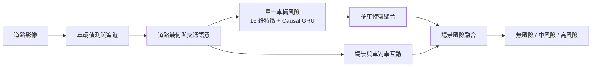
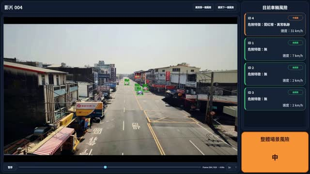

# Multi-Semantic Traffic Risk Assessment

以固定道路監視影像為輸入，整合車輛偵測與追蹤、道路幾何、超速、闖紅燈、異常軌跡、單車時間序列與多車互動，輸出「無／中／高」三級交通風險。

這個 repository 是從研究原始工作目錄抽出的精簡作品集版本。它只保留論文使用的模型、推論核心、必要設定與可重跑的等價驗證；歷史實驗、快取、重複輸出與大型資料集不納入。

精簡版將偵測追蹤、單車風險與場景風險分成可獨立執行的介面，並以明確的 CSV/NPZ 資料契約衔接，不需要原始工作目錄的絕對路徑。

## 方法概觀



- 單車層：以 16 維交通語意時間序列描述軌跡、速度、號誌與時間狀態，再以 causal GRU 和可解釋規則得到車輛風險。
- 場景層：每個時間窗最多保留 16 台車的 14 維 token，經編碼與 Max/Mean Pooling 後，和 59 維場景及互動特徵融合。
- 警示層：整合單車風險下限、模型機率與車對車互動，輸出三級場景風險。

## 論文結果

| 評估項目 | 結果 |
|---|---:|
| 單車風險，video-level 5-fold，window Macro F1 | 0.8894 ± 0.0084 |
| 單車風險，video-level 5-fold，track Macro F1 | 0.9227 ± 0.0417 |
| 場景風險，固定 test，severity Macro F1 | 0.9339 |
| 場景風險，固定 test，無／中／高風險 F1 | 0.9812 / 0.8674 / 0.9531 |

完整論文與簡報可見 [paper.pdf](docs/publications/paper.pdf) 與 [cvgip-presentation.pdf](docs/publications/cvgip-presentation.pdf)。

## 示範影片

每個案例同時提供原始 MP4 與結果 MP4。八部影片預計放在 GitHub Release，避免把約 300 MB 影片永久寫進 Git 歷史。

| Case 1：等待後逆向闖紅燈 | Case 2：壅塞車流蛇行 |
|---|---|
| [](https://github.com/chengting0822/multi-semantic-traffic-risk/releases/download/demo-v1/case01-wrong-way-red-light-violation.mp4) | [](https://github.com/chengting0822/multi-semantic-traffic-risk/releases/download/demo-v1/case02-weaving-dense-traffic.mp4) |
| [原始影片 14.mp4](https://github.com/chengting0822/multi-semantic-traffic-risk/releases/download/demo-v1/14.mp4) · [結果影片](https://github.com/chengting0822/multi-semantic-traffic-risk/releases/download/demo-v1/case01-wrong-way-red-light-violation.mp4) | [原始影片 76.mp4](https://github.com/chengting0822/multi-semantic-traffic-risk/releases/download/demo-v1/76.mp4) · [結果影片](https://github.com/chengting0822/multi-semantic-traffic-risk/releases/download/demo-v1/case02-weaving-dense-traffic.mp4) |
| Case 3：嚴重超速與逆向 | Case 4：闖紅燈與逆向複合事件 |
| [](https://github.com/chengting0822/multi-semantic-traffic-risk/releases/download/demo-v1/case03-severe-speeding-wrong-way.mp4) | [](https://github.com/chengting0822/multi-semantic-traffic-risk/releases/download/demo-v1/case04-red-light-wrong-way-combined.mp4) |
| [原始影片 96.mp4](https://github.com/chengting0822/multi-semantic-traffic-risk/releases/download/demo-v1/96.mp4) · [結果影片](https://github.com/chengting0822/multi-semantic-traffic-risk/releases/download/demo-v1/case03-severe-speeding-wrong-way.mp4) | [原始影片 115.mp4](https://github.com/chengting0822/multi-semantic-traffic-risk/releases/download/demo-v1/115.mp4) · [結果影片](https://github.com/chengting0822/multi-semantic-traffic-risk/releases/download/demo-v1/case04-red-light-wrong-way-combined.mp4) |

## 安裝

```bash
python -m venv .venv
source .venv/bin/activate
pip install -e '.[detection]'
traffic-risk doctor
```

PyTorch 的 CUDA 版本應依顯示卡與驅動環境安裝。YOLO 權重與 TensorRT engine 沒有放進 repository，需由使用者另行指定。

## 可執行範例

Repository 內附有四個案例的真實 prepared features，可直接重跑場景模型與正式 Hybrid 融合：

```bash
./scripts/run_demo.sh --device cpu
```

預設輸出為 `outputs/demo_scene_risk.csv`。程式會同時比對 183 個正式時間窗；應顯示 `mismatches=0`。範例資料說明請見 [examples/demo/README.md](examples/demo/README.md)。

## 使用方式

車輛偵測與追蹤：

```bash
traffic-risk detect -- input.mp4 \
  --output outputs/tracks.csv \
  --yolo-model /path/to/yolo-model.pt
```

對已準備好的 16 維單車特徵執行凍結 GRU：

```bash
traffic-risk predict-single data/single_vehicle_features.csv outputs/single_gru.csv
```

對已準備好的場景 tensor 執行凍結場景模型：

```bash
traffic-risk predict-scene-model data/scene_features.npz outputs/scene_model.csv --all-rows
```

執行場景模型與論文選定的 hybrid 融合，輸出最終 `risk_level`：

```bash
traffic-risk predict-scene \
  data/scene_features.npz \
  data/scene_windows.csv \
  data/scene_tokens.csv \
  data/interaction_features.csv \
  outputs/scene_risk.csv
```

最終單車規則鏈需要語意 sidecar；欄位與介面請見 [docs/data.md](docs/data.md)。研究等價性與正式來源請見 [docs/parity.md](docs/parity.md) 與 [docs/provenance.md](docs/provenance.md)。

若本機仍保留原始研究資料，可重跑四段逐列等價驗證：

```bash
python scripts/verify_original_parity.py \
  --original-root /path/to/original-project \
  --check all
```

## Repository 結構

```text
configs/                  道路幾何、追蹤器與凍結門檻
models/                   小型正式 checkpoint 與 SHA-256 manifest
src/traffic_risk/
  detection/              YOLO + ByteTrack + 號誌辨識
  single_vehicle/         causal GRU、語意規則與最終累積風險
  scene/                  多車 pooling、互動特徵與場景融合
assets/                   README 預覽圖與獲獎證明
examples/demo/             四個真實案例的小型可執行資料
docs/                     資料介面、來源、等價驗證、論文與簡報
tests/                    資產與設定 smoke tests
scripts/                  原始正式輸出的逐列等價驗證
```

## 資料集說明

訓練影片、逐幀軌跡、人工標註、快取和中間輸出不放入 GitHub。原因是容量、影像授權與隱私風險；這些資料也不是執行凍結模型的必要 repository 內容。公開版本提供資料欄位契約與模型權重，而不是宣稱包含可再現訓練的完整私有資料集。

## 團隊與貢獻

- 蔡承廷：專題規劃、系統與研究方法設計、約 90% 程式實作、模型實驗、整合與展示。
- 林武杰老師：專題指導與研究方向建議。
- 劉康申、謝宏喆：資料處理、模擬資料產生與研究意見。

## 獲獎

- CVGIP 相關證明：[certificate](assets/awards/cvgip-certificate.jpg)
- 校內專題競賽第三名：[certificate](assets/awards/university-project-third-place.jpg)

> 此 repository 目前是上傳前的精簡整理版；尚未推送至 GitHub。授權條款會在正式公開前確認。
