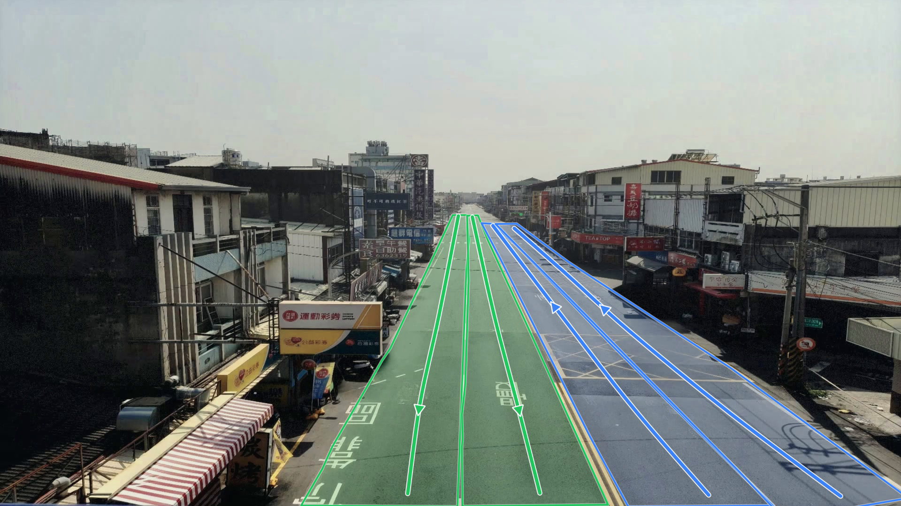
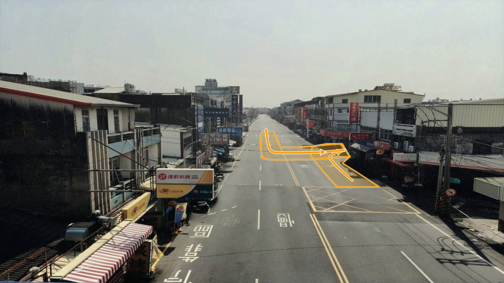
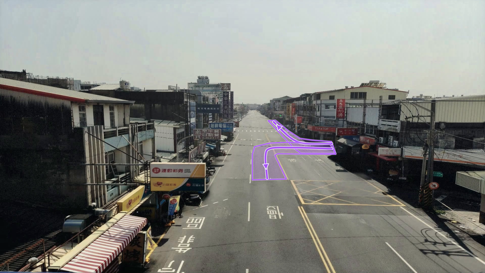

# 研究方法

[回到首頁](../README.md) · [模型架構](models.md) · [偵測與追蹤](detection.md) · [資料介面](data.md)

## 整體資料流

```text
固定式道路影片
  → 車輛偵測與多目標追蹤
  → 影像座標與道路幾何對應
  → 超速／闖紅燈／異常軌跡語意
  → 單一車輛風險
  → 多車、場景與車對車互動融合
  → 整體交通風險
```

## 1. 車輛偵測、追蹤與號誌

- **YOLO** 從每幀影像偵測車輛。
- **ByteTrack** 將連續影像中的偵測框連成具有 `track_id` 的軌跡。
- **輕量 CNN** 只處理預先標定的號誌 ROI，辨識紅燈與綠燈，避免對整張影像重複執行不必要的分類。

本研究目前只對汽車進行後續風險分析，這是研究範圍與限制，並非宣稱能完整評估所有用路人。在目前的 YOLO 設定與研究影像中，機車辨識較不穩定；而汽車通常具有較大的質量，事故時可能造成較嚴重的傷害。因此，本研究先以汽車為對象，把重點放在追蹤後的道路語意、行為分析與場景風險流程，而不是把機車偵測也當成已解決的問題。系統只納入同一 `track_id` 過半數幀判為汽車的軌跡；若這條軌跡偶爾被判成其他類別，仍保留那些幀，避免打斷軌跡。這並不表示機車對用路人沒有風險。

參數、GPU 執行方式與 CSV 欄位見 [偵測與追蹤](detection.md)。

## 2. 道路幾何與車道語意

不同鏡頭的視角不同，因此先對場景進行幾何標定：

- **有效 ROI**：排除不屬於目標道路的區域。
- **車道多邊形與方向**：說明車輛所在車道及合法移動方向。
- **虛擬停止線**：將畫面中的停止位置轉為可計算的線段，與紅燈狀態共同判斷越線。
- **IPM／Homography**：將影像平面的位置映射到道路平面，供距離、速度與車對車互動使用。

| 主線不同方向 | 主線駛入支線 | 支線駛入主線 |
|---|---|---|
|  |  |  |

這些車道圖是「道路語意定義」，不是模型偵測結果。當軌跡被映射到車道後，系統才能比較軌跡方向、車道合法方向與車道切換關係。

## 3. 多語意行為特徵

- **超速**：由世界座標中的軌跡位移估計速度，再經過時間平滑與可信度條件。
- **闖紅燈**：紅燈狀態、虛擬停止線越線與車輛移動方向必須同時成立。
- **異常軌跡**：比較軌跡與車道方向、橫向擺動、車道切換及轉彎語境。

特徵同時保留二元事件、持續程度與強度，讓後續模型不只看「有／沒有」。

## 4. 單一車輛與場景風險

單一車輛模型用時間序列表示同一輛車的風險變化；場景模型再整合多車風險、車輛數量、歷史狀態及互動特徵。

車對車互動主要包含：

- **CPA (Closest Point of Approach)**：按當前運動趨勢估計最接近時的距離。
- **TTC (Time to Collision)**：在相對運動條件成立時，估計到達潛在衝突的時間。

詳細維度與拼接方式見 [模型架構](models.md)。
